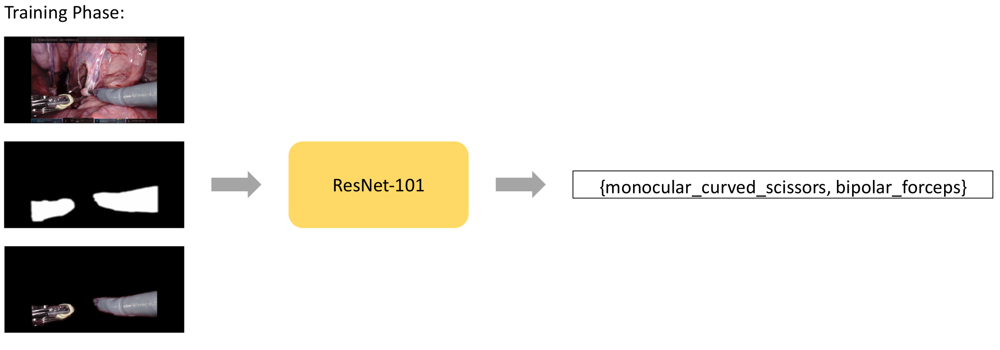
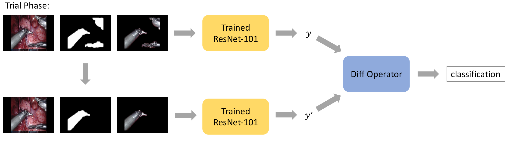
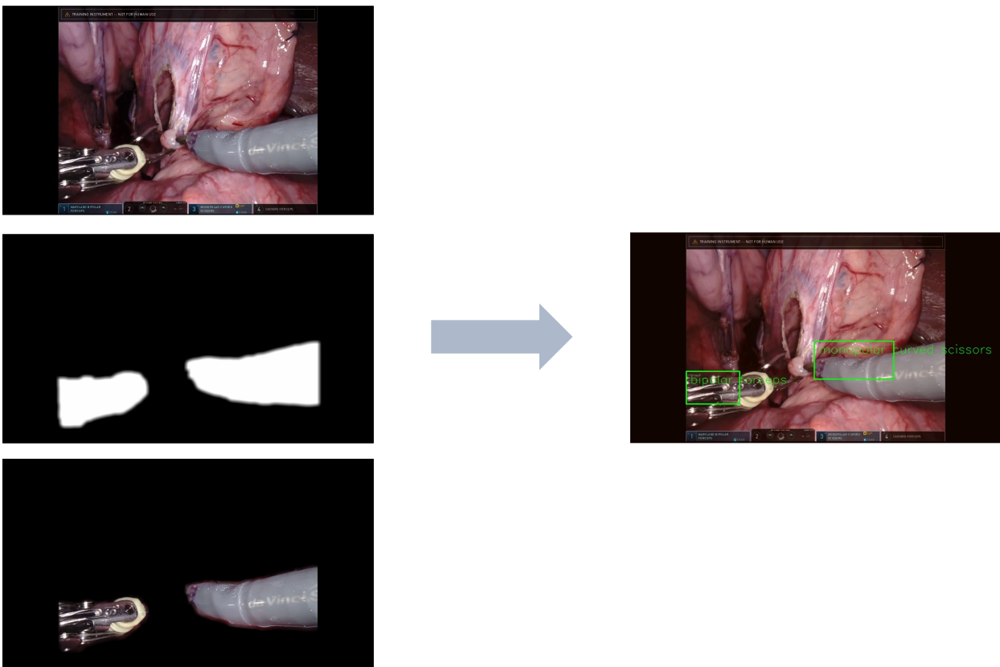
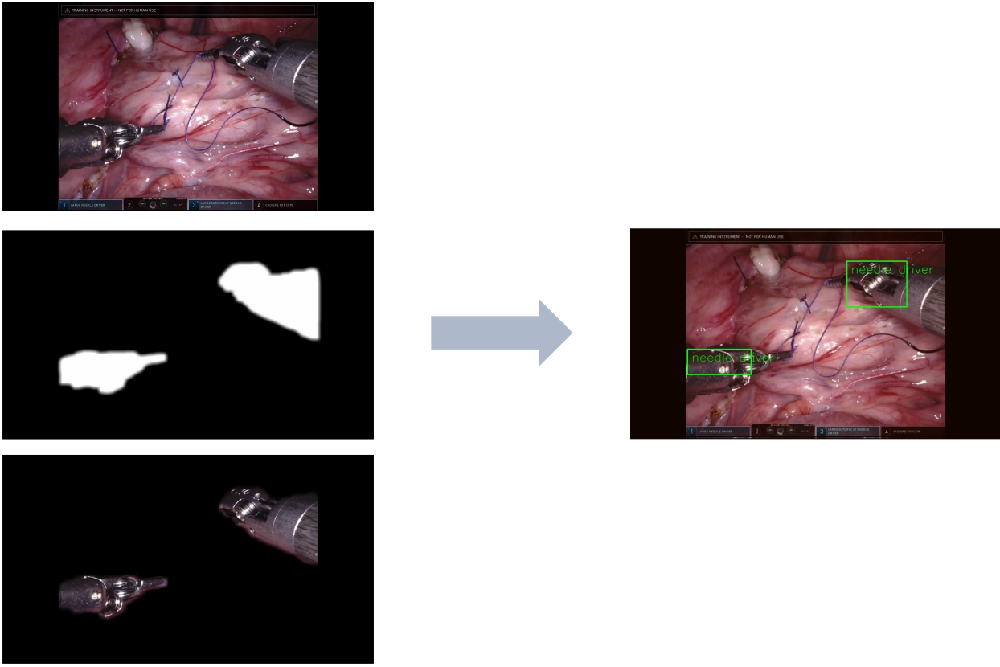
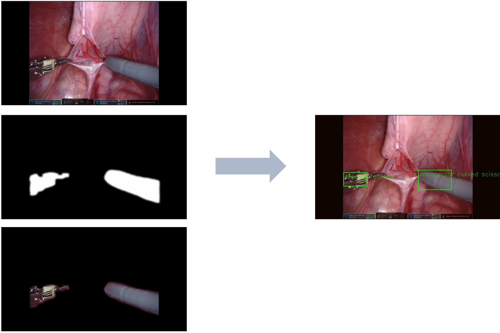
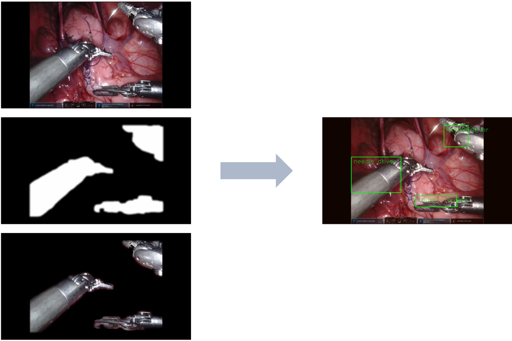
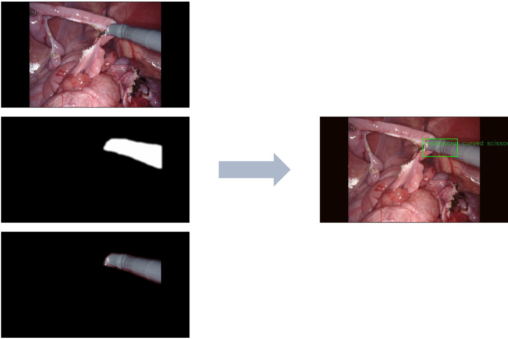

# MICCAI 2023 Surgical Tool Localization Challenge
by Team Maple Lab: Ayberk Acar, Jumanh Atoum, John Han, Yinhong Qin

We describe our solution for the MICCAI 2023 Surgical Tool Localization Challenge. The problem statement is the following: given a video and image labels of what tools exist in the frame, localize and classify the clevis of each tool of each frame from the video. It is a type of Weakly Supervised Object Detection (WSOD) problem, and this challenge is the first to apply the problem in the surgical robotics domain. 

## Overview 
Precise tracking and identification of instruments during a robotic surgery is essential to many downstream tasks, including, but not limited to, skill assessment and tool usage analysis. However, extracting labels for the object detection task is often time consuming and expensive, especially because it relies on domain experts such as surgeons and clinicians. Identifying bounding boxes and labeling each box is incredibly tedious. However, image-level labels (ie, what tools are used during the surgery) can be easily determined programmatically from the robot. Using just these labels for object detection (localization and classification) can eliminate the burden of annotations. Our solution to this Weakly Supervised Object Detection problem has two components:

1. An end-to-end network that can classify the tools in each video sequence employing the binary segmentation masks from the color images, and
2. A pipeline to classify each segmentation to its corresponding tool. 

## Method
First, we used a endoscopic tool binary segmentation model from EndoVis17, called the [TernausNet](https://github.com/ternaus/robot-surgery-segmentation). Using the original color image and its respective binary mask, we finetuned a pretrained ResNet101 model to correctly classify which tools are in the frame. We call this the "Training Phase".



After the training was complete, the ResNet model was used for the second "Trial Phase." To correctly classify a tool, every other tool was masked out, and the model was inferenced again. We compared the output scores when the other tools were masked out and when they were not. 



After a classification label is determined, we extracted an initial bounding box around the segmentation mask and scaled it down manually to a suitable size.

An Intel i9-13900K CPU and NVIDIA RTX 4090 GPU were used for training the ResNet. 

## Running the Code
Python 3.8 and PyTorch 2.0.1 was used to execute the project. You can install the necessary models from [this Google Drive link](https://drive.google.com/drive/folders/1q4RZPZ2cdhV6SMhZDEK83sNrqWuvtFNO?usp=sharing). There, you will need to install ternaus16.pt and category1.pt. 

First, create a conda environment using 

```
conda create --name maplelab python=3.8
```

And install all dependencies by

```
pip install -r requirements.txt
```

First, preprocessing is required in order to create the dataset for training purposes. Download the provided EndoVis23 dataset, enter `./attention_mask`, and run

```
python preprocess.py --input_dir /path/to/endovis23 --model_dir /path/to/ternaus16.pt
```

Note that the path to the EndoVis23 should be the parent directory, ie the directory with 'training_data' and 'readme.txt' files. This code creates train and test folders that separate the videos into images and their masks (by running inference on the pretrained Ternaus16 model from EndoVis17).

The trained ResNet-101 is provided as "category1.pt". We ran the following script in order to fine tune the ResNet-101 model.

```
python train.py --input_dir /path/to/endovis23 --logs ./logs/ --num_epochs 50 --batch_size 4
```

To run the trial phase to extract labeled bounding boxes, please run 

```
python trial.py --input_dir /path/to/endovis23 --model_dir /path/to/category1.pt --output ./output
```

in order to save output images as well as the completed json file required by the challenge.

## Example Outputs

<div class="row">
  <div class="column">
    
  </div>
  <div class="column">
    
  </div>
  <div class="column">
    
  </div>
  <div class="column">
    
  </div>
  <div class="column">
    
  </div>
</div>